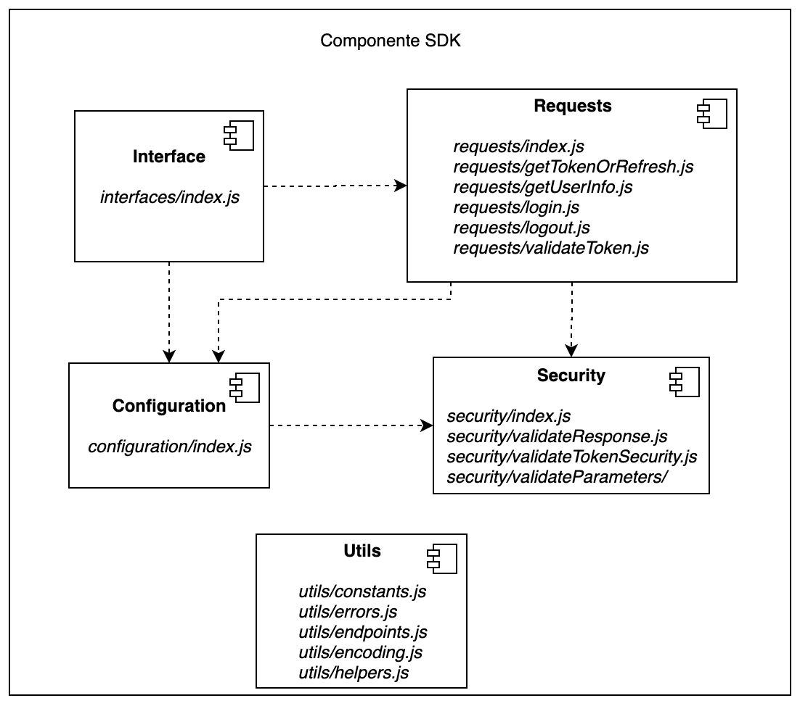

# Documentación técnica

## Índice

- [Introducción](https://github.com/elirosselli/pis2020/tree/develop/sdk/CONTRIBUTING.md#introducci%C3%B3n)
- [Diseño en alto nivel del componente SDK](https://github.com/elirosselli/pis2020/tree/develop/sdk/CONTRIBUTING.md#Diseño-en-alto-nivel-del-componente-SDK)
- [Funcionalidades del componente SDK](https://github.com/elirosselli/pis2020/tree/develop/sdk/CONTRIBUTING.md#funcionalidades-del-componente-sdk)
  - [Funcionalidades del módulo de configuración](https://github.com/elirosselli/pis2020/tree/develop/sdk/CONTRIBUTING.md#funcionalidades-del-m%C3%B3dulo-de-configuraci%C3%B3n)
  - [Funcionalidad de *initialize*](https://github.com/elirosselli/pis2020/tree/develop/sdk/CONTRIBUTING.md#funcionalidad-de-initialize)
  - [Funcionalidad de *login*](https://github.com/elirosselli/pis2020/tree/develop/sdk/CONTRIBUTING.md#funcionalidad-de-login)
  - [Funcionalidad de *getToken*](https://github.com/elirosselli/pis2020/tree/develop/sdk/CONTRIBUTING.md#funcionalidad-de-gettoken)
  - [Funcionalidad de *refreshToken*](https://github.com/elirosselli/pis2020/tree/develop/sdk/CONTRIBUTING.md#funcionalidad-de-refreshtoken)
  - [Funcionalidad de *getUserInfo*](https://github.com/elirosselli/pis2020/tree/develop/sdk/CONTRIBUTING.md#funcionalidad-de-getuserinfo)
  - [Funcionalidad de *validateToken*](https://github.com/elirosselli/pis2020/tree/develop/sdk/CONTRIBUTING.md#funcionalidad-de-validatetoken)
  - [Funcionalidad de *logout*](https://github.com/elirosselli/pis2020/tree/develop/sdk/CONTRIBUTING.md#funcionalidad-de-logout)
- [Ejecución de pruebas unitarias y *linter*](https://github.com/elirosselli/pis2020/tree/develop/sdk/CONTRIBUTING.md#ejecuci%C3%B3n-de-pruebas-unitarias-y-linter)

## Introducción

Este documento presenta documentación técnica detallada sobre la implementación de las funcionalidades del SDK y los módulos que lo componen. También se incluyen instrucciones para poder ejecutar las pruebas unitarias y el analizador estático de código (*linter*). Puede resultar útil para aquellos desarrolladores que busquen entender con mayor detalle el funcionamiento del componente y realizar modificaciones.

## Diseño en alto nivel del componente SDK

En esta sección se presenta una visión simplificada del diseño del componente junto con algunas recomendaciones en caso de agregar funcionalidades al componente.

### Módulos del componente SDK

El componente se encuentra dividido en cuatro módulos los cuales se presentan a continuación.


Correspondencia entre los módulos con los archivos y directorios del repositorio.



### Descripción de los módulos

#### Interface

Se encuentran las funcionalidades expuestas por el componente. Una vez que se invoca una funcionalidad al componente, el módulo interface resuelve la misma invocando funcionalidades expuestas por los módulos **Requests** o **Configuration**.
Si se desea incorporar una nueva funcionalidad al componente, se recomienda publicarla en éste módulo para mantener la coherencia del componente.

#### Configuration

En este módulo se encuentran definidos todos los parámetros que se utilizan durante la ejecución del componente.
La mayoría de los parámetros almacenados se corresponden con atributos que se utilizan en las peticiones HTTP que realiza el componente a la API de Id Uruguay.

El módulo posee funcionalidades para establecer u obtener los parámetros almacenados en el componente. Por lo tanto, en caso de agregar una variable o constante que será utilizada globalmente en el componente, se recomienda incorporarlo en este módulo.

#### Requests

Las peticiones HTTP a los diferentes *endpoints* de la API Id Uruguay se realizan en el módulo **Requests**. En este módulo se utiliza una variante de la implementación estándar de la función [fetch](https://developer.mozilla.org/es/docs/Web/API/Fetch_API/Utilizando_Fetch) de *Javascript* la cual incluye reintentos en caso de no obtener respuesta.

En caso de querer incluir nuevas peticiones a diferentes *endpoints*, se recomienda hacerlo en este módulo agregando el tipo de petición deseado.

#### Security

En el módulo **Security**, se implementan las validaciones de los tokens y los parametros del módulo **Configuration**. Además se realiza la validacion de las respuestas obtenidas por la API de Id Uruguay.

Se recomienda modificar este módulo en caso de agregar más controles en el componente.

## Funcionalidades del componente SDK

Esta sección presenta las funcionalidades brindadas por el componente SDK. Para cada funcionalidad se explica su utilidad y la forma en la que se encuentra implementada.

### Funcionalidades del módulo de configuración

Las funcionalidades de este módulo se encargarán de establecer, modificar o borrar los parámetros que se utilizan durante la ejecución del componente. Estos parámetros se encuentran en el objeto **parameters**, que consta de pares *(clave, valor)* donde la *clave* será el nombre del parámetro, y el *valor* tendrá el valor del parámetro.

Al comienzo de la ejecución todos los parámetros se encuentran vacíos, a excepción del parámetro *production* que tiene valor *false*. Las funciones encontradas en este módulo son:

- ***getParameters***: Encargada de obtener y retornar el valor de los parámetros.
- ***setParameters***: Encargada de establecer el valor de los parámetros soliticados.
- ***clearParameters***: Encargada de borrar el valor de los parámetros, excepto por los parámetros *redirectUri*, *clientId*, *clientSecret* y *production*.
- ***resetParameters***: Encargada de borrar el valor de todos los parámetros, a excepción del parámetro *production*.
- ***eraseCode***: Encargada de borrar el valor del parámetro *code*.
- ***eraseState***: Encargada de borrar el valor del parámetro *state*.
  
Todas estas funciones involucran los siguientes archivos:

- **sdk/configuration/index.js**: Donde se implementan todas las funciones anteriormente mencionadas.
- **sdk/utils/errors.js**: Donde se encuentran implementados los errores a retornar.

#### Funcionalidad de getParameters

##### Generalidades

Esta función retorna los parámetros encontrados en el módulo de configuración, que son utilizados por la amplia mayoría de las funciones del componente SDK. El funcionamiento general de **getParameters** consiste simplemente en retornar los parámetros encontrados en el objeto *parameters*.

##### Parámetros

La función de **getParameters** no recibe parámetros pues los obtiene del objeto *parameters*, y retorna todos los parámetros encontrados en el módulo de configuración.

##### Código

El código de esta función consta de solo una línea, que retorna los parámetros obtenidos del objeto *parameters*:

```javascript
const getParameters = () => parameters;
```

#### Funcionalidad de setParameters

##### Generalidades

Esta función se encarga de establecer el valor de los parámetros encontrados en el módulo de configuración. Además, antes de establecer su valor, los valida utilizando el módulo de seguridad. Esta validación implica verificar que dichos parámetros no contengan datos maliciosos o erróneos. Se considera que un parámetro es malicioso o erróneo si su valor es vacío cuando no debe serlo, contiene caracteres inválidos o el tipo de su valor no coincide con el tipo del parámetro correspondiente.
Muchas funciones del SDK *setean* parámetros utilizando esta función para que el resto del componente pueda utilizarlos.

El funcionamiento general de **setParameters** consiste en recorrer los valores pasados por parámetro, y *setearlos* en el módulo en caso de que no sean inválidos. Los chequeos de validez pueden sanitizar el parámetro eliminado caracteres o partes inválidas, de manera que no se retorna un error y se guarda el valor sanitizado. En caso de éxito se *setean* los valores de los parámetros retornando un mensaje de éxito. En caso contrario, se retorna un error indicando cual es el parámetro inválido.

##### Archivos y Parámetros

La función **setParameters** involucra los archivos mencionados anteriormente, junto con:
**sdk/security/validateParameters/index.js**: Donde se implementa la función de validación de parámetros del módulo de seguridad.

La función de **setParameters** recibe como parámetros los valores de los parámetros a *setear* en el módulo de configuración. En particular, recibe un objeto con parejas *(clave, valor)* donde la *clave* es el nombre del parámetro, y el *valor* contiene el valor a *setear* del parámetro. La función retorna el error de tipo *NO_ERROR* indicando que la operación resultó exitosa, o en caso contrario un error indicando el parámetro inválido.

##### Código

En primer lugar, se crea un objeto *validParameters*, donde se guardarán los pares *(clave, valor)* de los parámetros que son validados de manera exitosa.

Luego se tiene el siguiente código:

```javascript
Object.keys(params).forEach(key => {
  if (params[key] !== '') {
    try {
      validParameters[key] = validateParameters(PARAMETERS[key], params[key]);
    } catch (err) {
      if (!error) error = err;
    }
  }
});
```

Donde [*Object.keys()*](https://developer.mozilla.org/es/docs/Web/JavaScript/Referencia/Objetos_globales/Object/keys) retorna un arreglo de las propiedades *clave* de un objeto, en este caso el nombre de los parámetros, y con la función [*forEach(función_callback)*](https://developer.mozilla.org/es/docs/Web/JavaScript/Referencia/Objetos_globales/Array/forEach) se ejecuta la función (*function_callback*) indicada por cada elemento del *array*, donde a la clave actual se le llamará *key*.

En caso de que el valor correspondiente a la clave actual sea distinto de vacío, se ejecuta un bloque [*try-catch*](https://developer.mozilla.org/es/docs/Web/JavaScript/Referencia/Sentencias/try...catch). Se realiza este chequeo, ya que no se permiten *setear* valores vacíos. En el bloque *try*, se ejecuta la función **validateParameters** del módulo de seguridad, que se encarga de validar los valores de los parámetros como fue mencionado anteriormente. En caso de que el parámetro que esté siendo chequeado en la iteración sea válido, se *setea* el mismo en el objeto *validParameters*, en caso contrario, la función **validateParameters** lanzará una excepción que será capturada en el bloque *catch* donde se *setea* el error obtenido en la variable *error*.

En caso de error, se lanza una excepción indicando el *error* retornado por la función de validación de parámetros, con la sentencia [*throw*](https://developer.mozilla.org/es/docs/Web/JavaScript/Referencia/Sentencias/throw). En caso contrario, se *setean* los parámetros del módulo en el objeto *parameters* con los valores guardados en el objeto *validParameters*, y se retorna el error de tipo *NO_ERROR* indicando que no hubo error.

#### Funcionalidades de clearParameters y resetParameters

##### Generalidades

Estas funciones borran el valor de todos los parámetros, con las siguientes expeciones:

-**clearParameters**: no borra los parámetros *redirectUri*, *clientId*, *clientSecret* y *production*. Estos parámetros no son borrados ya que son necesarios para la mayoría de los *requests* y se asume que cambiarán con poca frecuencia o ninguna durante la ejecución del componente.
-**resetParameters**: no borra el parámetro *production*, para el cuál se *setea* su valor en *false*.

El funcionamiento general de ambas funciones consiste en recorrer los valores de los parámetros y borrarlos (*setearlos* al *string* vacío) en los casos mencionados.

##### Parámetros

Las funciones **clearParameters** y **resetParameters** no reciben parámetros y tampoco retornan ningún valor.

##### Código

Ambas funciones utilizan *Object.keys()* que retorna un arreglo de las propiedades *clave* de un objeto, en este caso, el nombre de los parámetros guardados en *parameters*, y con la función *forEach(función_callback)* se ejecuta la función (*function_callback*) indicada por cada elemento del *array*, donde a la clave actual se le llamará *key*. De esta manera, se recorren todos los parámetros, y se *setean* sus valores al *string* vacío en el objeto *parameters*, en los casos indicados. Para el caso de **resetParameters**, una vez terminada la recorrida de todos los parámetros, se *setea* el parámetro *production* a *false*.

#### Funcionalidades de *Erase Code* y *Erase State*

##### Generalidades

Estas funciones se encargan de borrar dos parámetros: **eraseCode** borra el parámetro *code* y **eraseState** el parámetro *state*.

El funcionamiento general de estas funciones consiste en borrar el valor de los parámetros mencionados (*setearlos* al *string* vacío). Se crearon estas funciones, ya que la función **setParameters** no permite *setear* valores vacíos, y en ciertas ocaciones se desean borrar estos dos parámetros particulares.

##### Parámetros

Las funciones de **eraseCode** y **eraseState** no reciben parámetros y tampoco retornan ningún valor.

##### Código

El código de estas funciones simplemente consiste en *setear* los parámetros correspondientes en el objeto *parameters* al *string* vacío.

### Funcionalidad de *initialize*

#### Generalidades

La funcionalidad de **initialize** se encarga de establecer los parámetros necesarios para la comunicación del componente con el OP. Estos parámetros son utilizados en la mayoría de las comunicaciones entre el componente y el OP, por lo que establecerlos una única vez le brinda a la aplicación móvil RP mayor comodidad en el uso del componente.

En particular, los parámetros mencionados son:

- *clientId*
- *clientSecret*
- *redirectUri*
- *production*
- *scope*

Los últimos dos parámetros pueden ser vacíos.

El funcionamiento general de **initialize** consiste en establecer los parámetros mencionados. En primer lugar, se chequea que los parámetros no sean vacíos (excepto por *scope*). Si alguno o varios de estos son vacíos entonces se lanza una excepción, retornando el error correspondiente según el primer parámetro vacío encontrado. En cambio, si los parámetros necesarios no son vacíos, se *setean* en el componente de configuración utilizando la función **setParameters** y se retorna un mensaje indicando que no hubo error. Una vez que se *setean* estos parámetros (excepto por el *scope*) no es posible *setear* su valor a vacío nuevamente.

#### Archivos y parámetros

La implementación de la funcionalidad de **initialize** involucra los siguientes archivos:

- **sdk/interfaces/index.js**: Donde se implementa la función **initialize**.
- **sdk/configuration/index.js**: Donde se implementa la función **setParameters** utilizada para *setear* los parámetros.
- **sdk/utils/helpers.js**: Donde se retornan los errores correspondientes en caso de un parámetro vacío.
- **sdk/utils/errors.js**: Donde se encuentran implementados los errores a retornar.

La función **initialize** recibe los parámetros *clientId*, *clientSecret*, *redirectUri*, *production* y *scope*, y retorna mensajes de éxito o de error según corresponda.

#### Código

En primer lugar, se chequea que los parámetros que no pueden ser vacíos (*clientId*, *clientSecret*, *redirectUri* y *production*) no lo sean. En caso de que no sean vacíos, se chequea si *scope* fue pasado como parámetro o no. En caso negativo, tendrá valor *undefined*, por lo cual se asigna a la variable *scopeToSet* el valor del *scope* en caso de existir o el *string* vacío. Luego, se *setean* los parámetros con la función **setParameters** y se retorna un objeto indicando que no hay error. Dicho objeto incluye un código (*errorCode*), una descripción (*errorDescription*) y un mensaje (*message*) que contiene el error de tipo *NO_ERROR*. En caso de que alguno de los parámetros necesarios sea vacío, se invoca a la función **initializeErrors**, que devolverá un error según el primer parámetro vacío que encuentre, y se lanzará una excepción con el error obtenido.

#### Errores

Los errores devueltos en cada caso son:

- En caso de éxito: `ERRORS.NO_ERROR`
- Cuando el parámetro *redirectUri* es vacío: `ERRORS.INVALID_REDIRECT_URI`
- Cuando el parámetro *clientId* es vacío: `ERRORS.INVALID_CLIENT_ID`
- Cuando el parámetro *clientSecret* es vacío: `ERRORS.INVALID_CLIENT_SECRET`
- Cuando el parámetro *production* no es booleano: `ERRORS.INVALID_PRODUCTION`
- En caso de error desconocido (no controlado) se retorna `ERRORS.FAILED_REQUEST`

### Funcionalidad de *login*

#### Generalidades

La funcionalidad de **login** se encarga de autenticar al usuario final directamente ante el OP para lo cual se utiliza el navegador web del dispositivo móvil. El funcionamiento general del **login** consiste en una función que devuelve una [promesa](https://developer.mozilla.org/es/docs/Web/JavaScript/Guide/Usar_promesas). Para esto, primero se envía un *Authentication Request* al OP a través del navegador web, donde se incluyen los parámetros necesarios para que el OP pueda validar al RP. Los parámetros obligatorios enviados son: *scope*, *response_type*, *client_id* y *redirect_uri*.

Para validar al RP, el OP verifica que el *client_id* y *redirect_uri* enviados en la *Authentication Request* coinciden con los generados al momento del [registro](https://centroderecursos.agesic.gub.uy/web/seguridad/wiki/-/wiki/Main/ID+Uruguay+-+Integración+con+OpenID+Connect) del RP ante el OP. Una vez que el RP es validado, el usuario final puede realizar el proceso de autenticación y autorización directamente ante el OP a través del navegador web. En este proceso se deben ingresar las credenciales de Usuario gub.uy y autorizar al RP al acceso a los datos solicitados. Cuando esta acción finaliza el usuario final debe confirmar para volver a la aplicación.

En caso de éxito, es decir que la RP sea validada ante el OP y el usuario final realice el proceso de autorización y autenticación correctamente, la función de **login** devuelve los parámetros *code* y *state*, junto a un mensaje de éxito. En caso contrario, ya sea porque no se pudo autenticar al RP, porque el usuario final no autoriza a la aplicación o porque no se puede realizar el *request*, se retorna una descripción acorde al error ocurrido.

#### Archivos y parámetros

La implementación de la funcionalidad de *login* involucra los siguientes archivos:

- **sdk/requests/login.js**: Donde se implementa la función **login**. Esta función se encarga de realizar el *Login Request*.
- **sdk/requests/index.js**: Donde se implementa la función **makeRequest**. Esta función invoca la función **login**.
- **sdk/interfaces/index.js**: Donde se invoca la función de **makeRequest**.
- **sdk/configuration/index.js**: Módulo de configuración de dónde se obtienen los parámetros necesarios.
- **sdk/utils/constants.js**: Contiene las constantes a utilizar.
- **sdk/utils/endpoints.js**: Contiene los *endpoints* a utilizar. Se obtienen los parámetros necesarios para realizar las *requests* invocando la función **getParameters** definida en el módulo de configuración.
- **sdk/utils/helpers.js**: Donde se retornan los errores correspondientes en caso de un parámetro vacío.
- **sdk/utils/errors.js**: Donde se encuentran implementados los errores a retornar.
- **sdk/security/index.js**: Donde se implementa la función **generateRandomState**, encargada de generar un parámetro *state* random, y *setearlo* en el módulo de configuración.

La función **login** no recibe parámetros, sino que obtiene los parámetros necesarios a utilizar en el *request* a través del módulo de configuración y retorna una promesa.

#### Código

La función de **login** es declarada como una función asincrónica de la siguiente manera:

```javascript
const login = async () => {
```

El fin de la función [*async*](https://developer.mozilla.org/es/docs/Web/JavaScript/Referencia/Sentencias/funcion_asincrona) es simplificar el uso de promesas. Esta función devolverá una promesa llamada *promise*, la cual es creada al principio del código. Se inicializa el parámetro *state* del módulo de configuración con un *string* aleatorio, a través de la función **generateRandomState**.
En el cuerpo de la función, dentro del bloque [*try*](https://developer.mozilla.org/es/docs/Web/JavaScript/Referencia/Sentencias/try...catch), se declara un [*Event Listener*](https://developer.mozilla.org/es/docs/Web/API/EventTarget/addEventListener) que escuchará por eventos del tipo '*url*', y ejecutará la función **handleOpenUrl** en caso de un evento de este tipo. Para poder interactuar con el *browser*, se utiliza [Linking](https://reactnative.dev/docs/linking). Esto se puede ver en la siguiente línea:

```javascript
Linking.addEventListener('url', handleOpenUrl);
```

En este punto se tiene un *Event Listener* que queda esperando por un evento del tipo '*url*'. Luego, se verifica que los parámetros necesarios para realizar la autenticación se encuentren ya definidos en el módulo de configuración. Si alguno de estos parámetros no se encuentra inicializado, se rechaza la promesa con un mensaje de error correspondiente, obtenido a través de la función **initializeErrors**. Por otro lado, si se encuentran inicializados, la función intenta abrir el navegador con la *url* deseada para enviar al *Login Endpoint*. Esta *url* contendrá el *clientId*, la *redirectUri* y opcionalmente *state*. Esto se puede ver a continuación:

```javascript
await Linking.openURL(loginEndpoint())
```

Al abrir el *browser*, *Linking.openURL* devuelve una promesa, que se resuelve apenas se abre el *browser* o no. Luego, el usuario final ingresa sus credenciales y decide si confirmar el acceso por parte de la aplicación a los datos solicitados.

Una vez realizado el *request* se retorna un *response* que corresponde con un HTTP *redirect* a la *redirectUri*, lo cual es detectado por el *Event Listener* como un evento *url*. Esto es visible para el usuario final a través de un mensaje desplegado en el *browser*, que pregunta si desea volver a la aplicación. Luego, se ejecuta la función **handleOpenUrl**, donde el evento capturado es un objeto que tiene *key url* y *value* un *string*. Este *value* será la *url* que en caso de éxito contiene el *code* y en caso contrario un error correspondiente.

Adicionalmente, se intenta obtener el *code* y el *state* enviado en la solicitud a través de expresiones regulares. En caso de encontrarse ambos parámetros, se resuelve la promesa retornando el *code*, *state* y un mensaje de éxito. En caso contrario, se rechaza la promesa con el mensaje de error correspondiente. Finalmente, se remueve el *Event Listener* para no seguir pendiente por más eventos. En el cuerpo de la función de **login** también se encuentra un bloque [*catch*](https://developer.mozilla.org/es/docs/Web/JavaScript/Referencia/Sentencias/try...catch), que en caso de error remueve el *Event Listener*, rechaza la promesa y devuelve un mensaje de error acorde. En todos los casos, al finalizar se borra el parámetro *state* del módulo de configuración con la función **eraseState**.

#### Errores

Los códigos de error devueltos en cada caso son:

- En caso de éxito: "gubuy_no_error"
- Cuando el parámetro *clientId* es vacío: "gubuy_invalid_client_id"
- Cuando el parámetro *redirectUri* es vacío: "gubuy_invalid_redirect_uri"
- Cuando el parámetro *clientSecret* es vacío: "gubuy_invalid_client_secret"
- Cuando el usuario final niega el acceso: "access_denied"
- Cuando el parámetro *state* obtenido en la *response* no coincide con el del módulo de configuración: "invalid_state"
- Cuando el parámetro *code* obtenido en la *response* no es válido: "gubuy_invalid_auhtorization_code"
- Cuando el *try* falla: "failed_request"

#### Errores

Los errores devueltos en cada caso son:

- En caso de éxito: `ERRORS.NO_ERROR`
- Cuando el parámetro *redirectUri* es vacío: `ERRORS.INVALID_REDIRECT_URI`
- Cuando el parámetro *clientId* es vacío: `ERRORS.INVALID_CLIENT_ID`
- Cuando el parámetro *clientSecret* es vacío: `ERRORS.INVALID_CLIENT_SECRET`
- Cuando el parámetro *production* no es booleano: `ERRORS.INVALID_PRODUCTION`
- Cuando no existe el parámetro *code*  en la URL retornada por el OP: `ERRORS.INVALID_AUTHORIZATION_CODE`
- Cuando el usuario final no autorice a la aplicación móvil RP a acceder a sus datos: `ERRORS.ACCESS_DENIED`
- En caso de error desconocido (no controlado) se retorna `ERRORS.FAILED_REQUEST`

### Funcionalidad de *getToken*

#### Generalidades

La función **getToken** se encarga de la comunicación entre la aplicación de usuario y el *Token Endpoint*, de forma de obtener los datos correspondientes a un *Token Request*. El objetivo principal de esta función es obtener un *token* para posteriormente utilizarlo con el fin de adquirir información del usuario final previamente autenticado. Por ende, esta función depende del *code* obtenido en la función **login**, además de requerir los datos de autenticación del usuario (*clientId* y *clientSecret*), y la *redirectUri* correspondiente. A partir de estos datos se realiza una consulta *Token Request* con el método POST al *Token Endpoint*.

Como resultado de la solicitud se obtiene un *Token Response* conteniendo los parámetros correspondientes. En caso de éxito, los valores de estos parámetros son almacenados en el componente de configuración, y la función retorna el *token* (*accessToken*, *refreshToken*, *idToken*, *tokenType* y *expiresIn*) obtenido y un mensaje de éxito. En caso contrario, se retorna al RP un código y descripción acorde al error ocurrido.

#### Archivos y parámetros

La implementación de la funcionalidad de **getToken** se encuentra implementada en la función **getTokenOrRefresh**, ya que su implementación es compartida con la funcionaldiad de **refreshToken**. La misma involucra los siguientes archivos:

- **sdk/requests/getTokenOrRefresh.js**: Donde se implementan las funcionalidades de **getToken** y **refreshToken**.
- **sdk/requests/index.js**: Donde se implementa la función **makeRequest**. Esta función invoca a **getTokenOrRefresh**.
- **sdk/interfaces/index.js**: Donde se invoca la función **makeRequest** y se implementa la función de **getToken**.
- **sdk/configuration/index.js**: Módulo de configuración, de dónde se obtienen los parámetros necesarios.
- **sdk/utils/constants.js**: Contiene las constantes necesarias.
- **sdk/utils/endpoints.js**: Contiene los *endpoints* a utilizar. Se obtienen los parámetros necesarios para realizar las *requests* invocando la función **getParameters** definida en el módulo de configuración.
- **sdk/utils/helpers.js**: Donde se retornan los errores correspondientes en caso de un parámetro vacío, y se implementa la función *fetch* utilizada para comunicarse con el *endpoint* correspondiente.
- **sdk/utils/errors.js**: Donde se encuentran implementados los errores a retornar.

La función **getTokenOrRefresh** recibe un solo parámetro, que indica si el *request* solicitado es del tipo **getToken** o **refreshToken**, y obtiene el resto de los parámetros necesarios a través del módulo de configuración. La función retorna una promesa, que cuando se resuelve retorna el *token* obtenido y un mensaje de éxito. En caso contrario, cuando se rechaza la promesa, se retorna un código y descripción indicando el error correspondiente.

#### Código

La función **getTokenOrRefresh**, recibe como único parámetro el tipo de *request*, que en el caso de la funcionalidad **getToken** será *REQUEST_TYPES.GET_TOKEN*.

Se utiliza la librería [base-64](https://github.com/mathiasbynens/base64) para codificar el *clientId* y el *clientSecret* siguiendo el esquema de autenticación [HTTP Basic Auth](https://tools.ietf.org/html/rfc7617). A continuación se arma la solicitud, mediante la función `fetch` y se procede a su envío. Utilizando la función de sincronismos `await` se espera una posible respuesta por parte del *Token Endpoint*. Ante un error en la solicitud se entra al bloque *catch* y se retorna el error correspondiente.

En caso de obtenerse una respuesta y que la misma sea exitosa, se *setean* los parámetros recibidos en el componente configuración, con la función **setParameters** y se resuelve la promesa con el valor correspondiente al *token* y un mensaje de éxito. En caso de error, se rechaza la promesa devolviendo el error recibido. En todos los casos, al finalizar se borra el parámetro *code* del módulo de configuración con la función **eraseState**.

#### Errores

Los códigos de error devueltos en cada caso son:

- En caso de éxito: "gubuy_no_error"
- Cuando el parámetro *clientId* es vacío: "gubuy_invalid_client_id"
- Cuando el parámetro *redirectUri* es vacío: "gubuy_invalid_redirect_uri"
- Cuando el parámetro *clientSecret* es vacío: "gubuy_invalid_client_secret"
- Cuando el parámetro *code* es vacío: "gubuy_invalid_auhtorization_code"
- Cuando el OP rechaza las credenciales enviadas: *invalid_client*
- En otro caso de error: "failed_request"

#### Errores

Los errores devueltos en cada caso son:

- En caso de éxito: `ERRORS.NO_ERROR`
- Cuando el parámetro *redirectUri* es vacío: `ERRORS.INVALID_REDIRECT_URI`
- Cuando el parámetro *clientId* es vacío: `ERRORS.INVALID_CLIENT_ID`
- Cuando el parámetro *clientSecret* es vacío: `ERRORS.INVALID_CLIENT_SECRET`
- Cuando el parámetro *code* es vacío: `ERRORS.INVALID_AUTHORIZATION_CODE`
- Cuando el parámetro *production* no es booleano: `ERRORS.INVALID_PRODUCTION`
- Cuando el parámetro *code* sea inválido o haya expirado, y no se pueda obtener un nuevo *token* de forma satisfactoria: `ERRORS.INVALID_GRANT`
- En caso de que el parámetro *client_id* o *client_secret* no se correspondan con los registrados ante el OP: `ERRORS.INVALID_CLIENT`.
- En caso de error desconocido (no controlado) se retorna `ERRORS.FAILED_REQUEST`

### Funcionalidad de *refreshToken*

#### Generalidades

La función **refreshToken** se encarga de obtener un nuevo *token*, cuando un *token* obtenido anteriormente se vuelve inválido o cuando simplemente se desea obtener uno nuevo. Por ende, esta función depende del *token* obtenido en la función **getToken**. A partir de este dato se realiza una consulta *Refresh Token Request* con el método POST al *Token Endpoint*.

Como resultado de la solicitud se obtiene un *Refresh Token Response* conteniendo los parámetros correspondientes, que serán los mismos que en un *Token Response*. En caso de éxito, los valores de estos parámetros son almacenados en el componente de configuración, y la función los retorna junto a un mensaje de éxito. En caso contrario, se retorna al RP un código y descripción acorde al error ocurrido.

#### Archivos y Parámetros

La implementación de la funcionalidad de **refreshToken** involucra los mismos archivos y mismos parámetros que **getToken**, ya que sus funcionalidades se encuentran implementadas en la misma función.

#### Código

La función **getTokenOrRefresh**, recibe como único parámetro el tipo de *request*, que en el caso de la funcionalidad **refreshToken** será *REQUEST_TYPES.GET_REFRESH_TOKEN*. Luego, las implementaciones de **getToken** y **refreshToken** serán la misma, a diferencia del *body* de la solicitud *fetch*. En el caso de la funcionalidad **refreshToken**, el *body* solo necesita del *grantType* mencionado en *Refresh Token Request Params* y el *refreshToken* obtenido anteriormente a través de **getToken**.

#### Errores

Los códigos de error devueltos en cada caso son:

- En caso de éxito: "gubuy_no_error"
- Cuando el parámetro *clientId* es vacío: "gubuy_invalid_client_id"
- Cuando el parámetro *redirectUri* es vacío: "gubuy_invalid_redirect_uri"
- Cuando el parámetro *clientSecret* es vacío: "gubuy_invalid_client_secret"
- Cuando el parámetro *refreshToken* es vacío, o es rechazado por el OP: *invalid_grant*
- Cuando el OP rechaza las credenciales enviadas: *invalid_client*
- En otro caso de error: "failed_request"

#### Errores

Los casos de errores son muy similares a los de la funcionalidad `getToken`.

Los errores devueltos en cada caso son:

- En caso de éxito: `ERRORS.NO_ERROR`
- Cuando el parámetro *redirectUri* es vacío: `ERRORS.INVALID_REDIRECT_URI`
- Cuando el parámetro *clientId* es vacío: `ERRORS.INVALID_CLIENT_ID`
- Cuando el parámetro *clientSecret* es vacío: `ERRORS.INVALID_CLIENT_SECRET`
- Cuando el parámetro *refreshToken* es vacío: `ERRORS.INVALID_GRANT`
- Cuando el parámetro *production* no es booleano: `ERRORS.INVALID_PRODUCTION`
- Cuando el parámetro *refreshToken* sea inválido o haya expirado: `ERRORS.INVALID_GRANT`
- En caso de que el parámetro *client_id* o *client_secret* no se correspondan con los registrados ante el OP: `ERRORS.INVALID_CLIENT`.
- En caso de error desconocido (no controlado) se retorna `ERRORS.FAILED_REQUEST`

### Funcionalidad de *getUserInfo*

#### Generalidades

La función **getUserInfo** se encarga de la comunicación entre la aplicación de usuario y el *User Info Endpoint*, de forma de obtener los datos correspondientes al usuario final *logueado*. Por ende, esta función depende del *access_token* obtenido en la función **getToken**, de manera de realizar mediante el método GET, un pedido al *User Info Endpoint*. La información del usuario final devuelta por la función, dependerá del *scope* *seteado* al realizar el **login**. Dicha información será devuelta en formato JSON.

#### Archivos y parámetros

La implementación de la funcionalidad de *getUserInfo* involucra los siguientes archivos:

- **sdk/requests/getUserInfo.js**: Donde se implementa la función **getUserInfo**. Esta función se encarga de realizar la *GetUserInfo Request*.
- **sdk/requests/index.js**: Donde se implementa la función **makeRequest**. Esta función invoca la función **getUserInfo**.
- **sdk/interfaces/index.js**: Donde se invoca la función de **makeRequest**.
- **sdk/configuration/index.js**: Módulo de configuración, de dónde se obtienen el *access_token* necesario.
- **sdk/utils/constants.js**: Contiene las constantes a utilizar.
- **sdk/utils/endpoints.js**: Contiene los *endpoints* a utilizar. Se obtienen los parámetros necesarios para realizar las *requests* invocando la función **getParameters** definida en el módulo de configuración.
- **sdk/utils/helpers.js**: Donde se implementa la función *fetch* utilizada para comunicarse con el endpoint correspondiente.
- **sdk/utils/errors.js**: Donde se encuentran implementados los errores a retornar.
- **sdk/security/index.js**: Donde se implementa la función **validateSub**, encargada de validar el parámetro *sub*, contenido en la *response* del OP.

La función **getUserInfo** no recibe parámetros, sino que obtiene los parámetros necesarios a utilizar en el *request* a través del módulo de configuración. La función retorna una promesa, que cuando se resuelve retorna un objecto en formato JSON correpondiente a la información del usuario final según los *scopes* definidos, junto a un mensaje de éxito. En caso contrario, cuando se rechaza la promesa, se retorna un código y descripción indicando el error correspondiente.

A continuación se presenta una lista con ejemplos de posibles valores de retorno de la función *getUserInfo* en función de los distintos scopes *seteados*.

Scope: openId:

```javascript
{
  sub: '5968',
}
```

Scope: openId y profile:

```javascript
{
  name: 'Clark Jose Kent Gonzalez',
  given_name: 'Clark Jose',
  family_name: 'Kent Gonzalez',
  sub: "5869",
}
```

Scope: openId y email:

```javascript
{
  email: 'kentprueba@gmail.com',
  email_verified: true,
  sub: "5869",
}
```

Scope: openId y auth_info:

```javascript
{
  ae: "urn:uce:ae:1",
  nid: "urn:uce:nid:1",
  rid: "urn:uce:rid:1",
  sub: "5869",
}
```

Scope: openId y document:

```javascript
{
  pais_documento: { codigo: 'uy', nombre: 'Uruguay' },
  tipo_documento: { codigo: 68909, nombre: 'C.I.' },
  numero_documento: '12345678',
  sub: "5869",
}
```

Scope: openId y personal_info:

```javascript
{
  nombre_completo: 'Clark Jose Kent Gonzalez',
  primer_apellido: 'Kent',
  primer_nombre: 'Clark',
  segundo_apellido: 'Gonzalez',
  segundo_nombre: 'Jose',
  sub: '5968',
  uid: 'uy-cid-12345678',
}
```

Scope: Todos los scopes:

```javascript
{
  sub: '5968',
  name: 'Clark Jose Kent Gonzalez',
  given_name: 'Clark Jose',
  family_name: 'Kent Gonzalez',
  nickname: 'uy-ci-12345678',
  email: 'kentprueba@gmail.com',
  email_verified: true,
  nombre_completo: 'Clark Jose Kent Gonzalez',
  primer_nombre: 'Clark',
  segundo_nombre: 'Jose',
  primer_apellido: 'Kent',
  segundo_apellido: 'Gonzalez',
  uid: 'uy-ci-12345678',
  pais_documento: { codigo: 'uy', nombre: 'Uruguay' },
  tipo_documento: { codigo: 68909, nombre: 'C.I.' },
  numero_documento: '12345678',
  ae: 'urn:uce:ae:1',
  nid: "urn:uce:nid:1",
  rid: "urn:uce:rid:1",
}
```

#### Código

La función de **getUserInfo** es declarada como una función asincrónica de la siguiente manera:

```javascript
const getUserInfo = async () => {
```

Esta realiza una request mediante la función `fetch`. Utilizando la función de sincronismos `await` se espera una posible respuesta por parte del *getUserInfo Endpoint*.

En el cuerpo de la función de **getUserInfo**, primero se verifica que los parámetros *accessToken* e *idToken* se encuentren definidos en el módulo de configuración. En caso negativo, se rechaza la promesa con un mensaje de error correspondiente. A continuación, se encuentra un bloque de *try* y uno de *catch*. En el de *try*, en caso de éxito se retorna una promesa con los valores mencionados anteriormente, y un mensaje de éxito. Si la *response* tiene un código de error, o el *sub* que retorna no es válido, se retorna un código de error y una descripción del mismo. Esto último se valida a través de la función **validateSub**. En el bloque de *catch*, se retorna un código de error y una descripción del mismo.

#### Errores

Los códigos de error devueltos en cada caso son:

- En caso de éxito: "gubuy_no_error"
- Cuando el parámetro *access_token* es vacío, o es rechazado por el OP: "invalid_token"
- Cuando el parámetro *idToken* es vacío: "gubuy_invalid_id_token"
- Cuando el parámetro *sub* retornado por el OP es inválido: "gubuy_invalid_sub"
- En otro caso de error: "failed_request"

#### Errores

Los errores devueltos en cada caso son:

- En caso de éxito: `ERRORS.NO_ERROR`
- Cuando el parámetro *accessToken* es vacío: `ERRORS.INVALID_TOKEN`
- Cuando el parámetro *idToken* es vacío: `ERRORS.INVALID_ID_TOKEN`
- Cuando el *sub* correspondiente al *token* utilizado no coincida con el *sub* de la respuesta del OP: `ERRORS.INVALID_SUB`
- En caso de error desconocido (no controlado) se retorna `ERRORS.FAILED_REQUEST`

### Funcionalidad de validateToken

#### Generalidades

La funcionalidad de **validateToken** se encarga de validar el *token* provisto por el OP, es decir, comparar que los atributos que lo componen coincidan con aquellos definidos por el OP. Para poder realizar dicha acción se obtiene el `jwks` (**JSON Web Key Set**), que es un conjunto de `jwk` ([**JSON Web Key**](https://tools.ietf.org/html/rfc7517)), que representan una clave criptográfica en formato JSON. Estos son expuestos en el [JWKS Endpoint](https://auth.iduruguay.gub.uy/oidc/v1/jwks), y se obtienen en el módulo *requests*, en la función **validateToken**.

Una vez obtenido el `jwks` correspondiente, se procede a validar el *idToken* obtenido en una llamada a **getToken** o **refreshToken**, para lo cual se invoca a la función **validateTokenSecurity** del módulo seguridad pasando como parámetro el `jwks` obtenido. Dentro del módulo se utiliza la librería [`jsrsasign`](https://github.com/kjur/jsrsasign), que provee funcionalidades que permiten la decodificación y validación del *idToken*.

Los atributos que se validan en esta función son los siguientes:

| Parámetro | Descripción                           |
|-----------|---------------------------------------|
| alg       | Algoritmo de la firma.                |
| iss       | Quien creó y firmó el *token*.          |
| aud       | Para quién está destinado el *token*.   |
| exp       | Tiempo de expiración.                 |
| kid       | Identificador único.                  |
| acr       | Authentication Context Class Reference|
| amr       | Authentication Methods References     |

En caso de que el *idToken* sea inválido, se retorna el error `ERRORS.INVALID_ID_TOKEN`. Si el *clientId* es vacío se retorna el error `ERRORS.INVALID_CLIENT_ID`. Y si la *request* no se realiza correctamente se devuelve un error de tipo `ERRORS.FAILED_REQUEST`.

#### Archivos y parámetros

- **sdk/requests/validateToken.js**: Donde se implementa la función **validateToken**. Esta función se encarga de realizar la *JWKS Request* al *JWKS Endpoint*, obteniendo el *JWKS*, además de llamar a la función **validateTokenSecurity** del módulo de seguridad.
- **sdk/security/validateTokenSecurity**: Se implementa la lógica de la validación del *idToken*, y devuelve el resultado de esta.
- **sdk/requests/index.js**: Donde se implementa la función **makeRequest**. Esta función invoca la función **validateToken**.
- **sdk/interfaces/index.js**: Donde se invoca la función de **makeRequest** con el tipo *REQUEST_TYPES.VALIDATE_TOKEN*.
- **sdk/configuration/index.js**: Módulo de configuración, de dónde se obtienen los parámetros necesarios.
- **sdk/utils/constants.js**: Contiene las constantes a utilizar.
- **sdk/utils/errors.js**: Contiene los errores a retornar.
- **sdk/utils/endpoints.js**: Contiene los *endpoints* a utilizar. Se obtienen los parámetros necesarios para realizar las *requests* invocando la función **getParameters** definida en el módulo de configuración.

La función **validateToken** del módulo *requests* no recibe ningún parámetro, sino que obtiene, en primer lugar, el *idToken* y *clientId* del componente de configuración, el *issuer* del archivo de constantes y el valor del `jwks` de la petición realizada al *JWKS Endpoint*. En caso de que haya algún problema se retorna el error correspondiente (`ERRORS.INVALID_CLIENT_ID`, `ERRORS.INVALID_ID_TOKEN` o `ERRORS.INVALID_REQUEST`). Si no hubo problema, estos parámetros son pasados a la función **validateTokenSecurity** del componente de seguridad, que los utilizará para realizar la respectiva validación del *idToken*, y retornará un error de tipo `ERRORS.INVALID_TOKEN` si el token en inválido, y en caso contrario, se retorna `ERRORS.NO_ERROR`.

#### Código

La función de **validateToken** es declarada como una función asincrónica de la siguiente manera:

```javascript
const validateToken = async () => {
```

La función **validateToken** invoca a la función **makeRequest** con el parámetro *REQUEST_TYPES.VALIDATE_TOKEN*, indicando que es un *request* del tipo *validateToken*. Luego, dentro de **makeRequest**, se realiza la *request* como se mencionó previamente.

Dentro del archivo `requests/validateToken.js`, se chequea que los parámetros requeridos (*clientId* e *idToken*) existan, y en caso de que no, se rechaza la promesa con un error de tipo `ERRORS.INVALID_CLIENT_ID` o `ERRORS.INVALID_ID_TOKEN` respectivamente.

A continuación se arma la solicitud, mediante la función `fetch` y se procede a su envío. Utilizando la función de sincronismos `await` se espera una posible respuesta por parte del *JWKS Endpoint*.

En el cuerpo de la función de **validateToken** se encuentra un bloque de *try* y uno de *catch* que encapsulan la llamada a la función `fetch`. Con esto se logra que si la función se ejecuta de forma incorrecta se rechaza la promesa devolviendo un código de error `ERRORS.FAILED_REQUEST` y una descripción. Por el contrario, en caso de que la respuesta sea satisfactoria, se retorna el resultado de llamar a la función **validateTokenSecurity** del módulo de seguridad, pasando como parámetro el `jwks` obtenido.

En la función **validateTokenSecurity** se utiliza las funcionalidades provistas por la librería `jsrsasign`. En primer lugar se obtiene la clave pública a partir de dos de los parámetros devueltos en el `jwks` obtenido, el `n` (*modulous*)  y el `e` (*exponente*). Esta clave pública se pasa a la función **verifyJWT** de la librería antes mencionada, que se encarga de decodificar y validar los siguientes atributos:

| Parámetro | Descripción                         | Comparado con                               |
|-----------|-------------------------------------|---------------------------------------------|
| alg       | Algoritmo de la firma.              | Atributo `alg` del *jwksResponse*.          |
| iss       | Quien creó y firmó el *token*.        | *Issuer* definido en el archivo de *endpoints*. |
| aud       | Para quién está destinado el *token*. | *ClientId* asignado al SDK.                   |
| exp       | Tiempo de expiración.               | Fecha y hora actual.                        |

Posteriormente se agrega una capa extra de validación, con otros atributos. Para esto primero se decodifica el *idToken* ([JWT](https://tools.ietf.org/html/rfc7519)), obteniendo el *header* y el *payload*. Del *header* se valida el atributo *kid*, comparándolo con el recibido en la *JWKS response*. Por otro lado, del *payload* se valida el *acr* y el *amr*, comprobando que estén incluidos en los definidos en el archivo de constantes. En la siguiente tabla se puede ver la definición de los parámetros *acr* y *amr*, así como los posibles valores que puede tomar.

| Parámetro | Descripción                                                                                                                                                        | Valores posibles                                                                                                                                                                                                    |
|-----------|--------------------------------------------------------------------------------------------------------------------------------------------------------------------|---------------------------------------------------------------------------------------------------------------------------------------------------------------------------------------------------------------------|
| acr       | *Authentication Context Class Reference*: conjunto de métodos o procedimientos de autenticación que se consideran equivalentes entre sí en un contexto particular. | ``` [  'urn:iduruguay:nid:0',  'urn:iduruguay:nid:1',  'urn:iduruguay:nid:2',  'urn:iduruguay:nid:3', ] ```                                                                                                        |
| amr       | *Authentication Methods References*: *array* de *strings* que corresponden a identificadores de métodos de autenticación usados en la autenticación.                   | ``` [  'urn:iduruguay:am:password',  'urn:iduruguay:am:totp',  'urn:iduruguay:am:ci',  'urn:iduruguay:am:idp:ae:0',  'urn:iduruguay:am:idp:ae:1',  'urn:iduruguay:am:idp:ae:2',  'urn:iduruguay:am:idp:ae:3', ] ``` |

Por último, se comprueba que las validaciones anteriores se hayan realizado con éxito, y en ese caso se resuelve la promesa retornando los siguientes valores:

```javascript
Promise.resolve({
  jwk: jwksResponse,
  message: ERRORS.NO_ERROR,
  errorCode: ERRORS.NO_ERROR.errorCode,
  errorDescription: ERRORS.NO_ERROR.errorDescription,
});
```

En caso contrario se rechaza la promesa con un error de tipo `ERRORS.INVALID_ID_TOKEN`:

```javascript
Promise.reject(ERRORS.INVALID_ID_TOKEN);
```

#### Errores

Los errores devueltos en cada caso son:

- En caso de éxito: `ERRORS.NO_ERROR`
- Cuando el parámetro *clientId* es vacío: `ERRORS.INVALID_CLIENT_ID`
- Cuando el parámetro *token* es vacío: `ERRORS.INVALID_ID_TOKEN`
- Cuando el parámetro *token* no se pueda validar en el modulo de seguridad: `ERRORS.INVALID_ID_TOKEN`.
- En caso de error desconocido (no controlado) se retorna `ERRORS.FAILED_REQUEST`

### Funcionalidad de *logout*

#### Generalidades

La funcionalidad de **logout** se encarga de cerrar la sesión del usuario final en el OP. El funcionamiento general del **logout** consiste en una función que devuelve una promesa. Para esto, primero se envía un *Logout Request* al OP a través de la función *fetch*, donde se incluyen los parámetros necesarios para que el OP pueda efectuar el cierre de sesión. El único parámetro obligatorio enviado es *idTokenHint*, el cual se corresponde con el *idToken* obtenido en la última *Get Token Request* o *Refresh Token Request*. Además de este parámetro obligatorio, el SDK genera un parámetro de seguridad *state* a enviar al OP en la solicitud.

En caso de que el parámetro *idTokenHint* sea correcto, la función de **logout** cierra la sesión del usuario ante el OP y devuelve el parámetro *state*, junto a un mensaje de éxito. En caso contrario, se retorna una descripción acorde al error ocurrido.

#### Archivos y parámetros

La implementación de la funcionalidad de *logout* involucra los siguientes archivos:

- **sdk/requests/logout.js**: Donde se implementa la función **logout**. Esta función se encarga de realizar la *Logout Request*.
- **sdk/requests/index.js**: Donde se implementa la función **makeRequest**. Esta función invoca la función **logout**.
- **sdk/interfaces/index.js**: Donde se invoca la función de **makeRequest**.
- **sdk/configuration/index.js**: Módulo de configuración, de dónde se obtienen los parámetros necesarios.
- **sdk/utils/constants.js**: Contiene las constantes a utilizar.
- **sdk/utils/endpoints.js**: Contiene los *endpoints* a utilizar. Se obtienen los parámetros necesarios para realizar las *requests* invocando la función **getParameters** definida en el módulo de configuración.
- **sdk/utils/helpers.js**: Donde se implementa la función *fetch* utilizada para comunicarse con el *endpoint* correspondiente.
- **sdk/utils/errors.js**: Donde se encuentran implementados los errores a retornar.
- **sdk/security/index.js**: Donde se implementa la función **generateRandomState**, encargada de generar un parámetro *state* random, y *setearlo* en el módulo de configuración.

La función **logout** no recibe parámetros, sino que obtiene los parámetros necesarios a utilizar en la *request* a través del módulo de configuración, en la función **logoutEndpoint** definida en el archivo de *endpoints* previamente mencionado, y retorna una promesa. Cuando se resuelve dicha promesa se obtiene un código y descripción indicando que la operación resultó exitosa, y si corresponde el parámetro *state*. En caso contrario, cuando se rechaza la promesa se retorna un código y descripción indicando el error correspondiente.

#### Código

La función de **logout** es declarada como una función asincrónica de la siguiente manera:

```javascript
const logout = async () => {
```

El fin de la función *async* es simplificar el uso de promesas. Esta función devolverá una promesa llamada *promise*.

En el cuerpo de la función, primero se inicializa el parámetro *state* del módulo de configuración con un *string* aleatorio, generada por la función **generateRandomString**. Luego, se verifica que el parámetro *idToken* se encuentre ya definido en el módulo de configuración. En el caso de que no, se rechaza la promesa con un mensaje de error correspondiente. Por otro lado, si se encuentra inicializado, se envía una solicitud al *Logout Endpoint* utilizando la función *fetch*. La *URL* con la que se envía esta solicitud contiene el *idTokenHint*, y opcionalmente *state*. Esto se puede ver a continuación

```javascript
Linking.openURL(logoutEndpoint())
```

Una vez realizado el request se retorna un *response* que, en caso de éxito, contendrá una *URL* que se corresponde con la utilizada para realizar el *request*.

En caso que la *URL* retornada sea efectivamente dicha URI, se resuelve la promesa. En caso contrario se rechaza la promesa, con el mensaje de error correspondiente. Finalmente, se remueve el *Event Listener* para no seguir pendiente por más eventos.

#### Errores

Los códigos de error devueltos en cada caso son:

- En caso de éxito: "gubuy_no_error"
- Cuando el parámetro *idTokenHint* es vacío: "invalid_id_token_hint"
- Cuando la *url* obtenida en la *response* no coincide con la URI con la cual se hizo la solicitud: "invalid_url_logout"
- En otro caso de error: "failed_request"

#### Errores

Los errores devueltos en cada caso son:

- En caso de éxito: `ERRORS.NO_ERROR`
- Cuando el parámetro *idToken* es vacío: `ERRORS.INVALID_ID_TOKEN_HINT`
- Cuando el parámetro *idToken* no es vacío, y la URL contenida en la respuesta del OP no coincida con el *logoutEndpoint*: `ERRORS.INVALID_URL_LOGOUT`
- En caso de error desconocido (no controlado) se retorna `ERRORS.FAILED_REQUEST`

## Endpoints de producción y testing

Todas las funcionalidades descritas en la sección anterior obtienen la *URL* que utilizarán para hacer el pedido al OP a través del archivo **sdk/utils/endpoints.js**. En este, cada *URL* tendrá un prefijo común que dependerá del parámetro *production* del módulo de configuración. A modo de ejemplo, para el logout esta *URL* se define como

```javascript
`${endpointPrefix}/logout?id_token_hint=${idToken}&post_logout_redirect_uri=&state=${state}`
```

donde *endpointPrefix* tendrá el valor

```javascript
'https://auth-testing.iduruguay.gub.uy/oidc/v1'
```

si el SDK se encuentra en modo *testing*, con el parámetro *production* en *false*, y

```javascript
'https://auth.iduruguay.gub.uy/oidc/v1'
```

en caso de que dicho parámetro se encuentre inicializado en *true*.

## Ejecución de pruebas unitarias y *linter*

Los comandos explicados a continuación se encuentran definidos en el archivo `package.json`, en la sección *scripts*.

### Pruebas unitarias

Para ejecutar las pruebas unitarias, se deberá ejecutar el siguiente comando dentro de la carpeta /sdk:

`npm run test`

Además, se puede obtener el cubrimiento (*coverage*) de las pruebas unitarias ejecutando el siguiente comando:

`npm run testCoverage`

Se observa que este comando también ejecuta las pruebas unitarias y devuelve sus resultados, devolviendo además los porcentajes de cubrimiento para los criterios de cubrimiento definidos.

### *Linter*

Para ejecutar el *linter* se deberá ejecutar el siguiente comando dentro de la carpeta /sdk:

`npm run linter`

Las reglas que aplica el *linter* se encuentran definidas en los archivos `.eslintrc.json` y `.prettierrc.js`.
