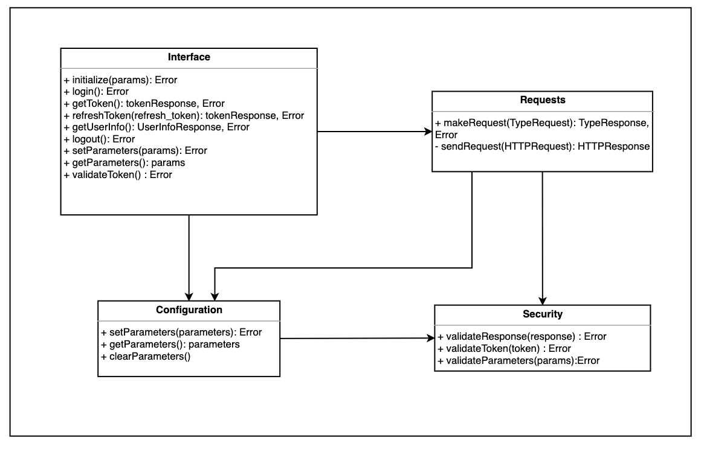

# Arquitectura del componente SDK

## Introducción

En este documento se presenta una visión simplificada del diseño del componente junto con algunas recomendaciones en caso de agregar funcionalidades al componente.  Para obtener mas detalles sobre los casos de uso y decisiones tomadas, dirigirse al documento DescripcionDeLaArquitectura.pdf?

## Módulos del componente SDK
El componente se encuentra dividido en cuatro módulos los cuales se encargan de funcionalidades específicas. 

## Descripción de los módulos
### Interface 
Se encuentran las funcionalidades expuestas por el componente. Una vez que se invoca una funcionalidad al componente, el módulo interface resuelve la misma invocando funcionalidades expuestas por los modulos Request o Configuration. 
Si se desea incorporar una nueva funcionalidad al componente, se recomienda publicarla en éste módulo para mantener la coherencia del mismo.
### Configuration 

En este módulo principalmente se encuentran almacenados todas las variables (llamadas parámetros) que se utilizan durante la ejecución del componente.
La mayoría de los parámetros almacenados se corresponden con atributos que se utilizan en las peticiones HTTP que realiza el componente a la API de Id Uruguay.

El módulo posee funcionalidades para establecer u obtener los parámetros almacenados en el componente. Por lo tanto, en caso de agregar una variable/constante utilizada por el componente, se recomienda incorporarlo en este módulo.

### Requests

Las peticiones HTTP a los diferentes EndPoints de la API Id Uruguay se realizan en el módulo Requests. En este módulo se utiliza una variante de la implementación estándar de la función [fetch](https://developer.mozilla.org/es/docs/Web/API/Fetch_API/Utilizando_Fetch) de Javascript la cual incluye reintentos en caso de no obtener respuesta.

En caso de querer incluir mas peticiones a diferentes endpoints, se recomienda hacerlo en este módulo agregando el tipo de petición deseado. 

### Security 

En el módulo security, se implementan las validaciones de los tokens y los parametros del módulo Configuration. Además se realiza la validacion de las respuestas obtenidas por la API de Id Uruguay.

Se recomienda modificar este módulo en caso de agregar más controles en el componente.